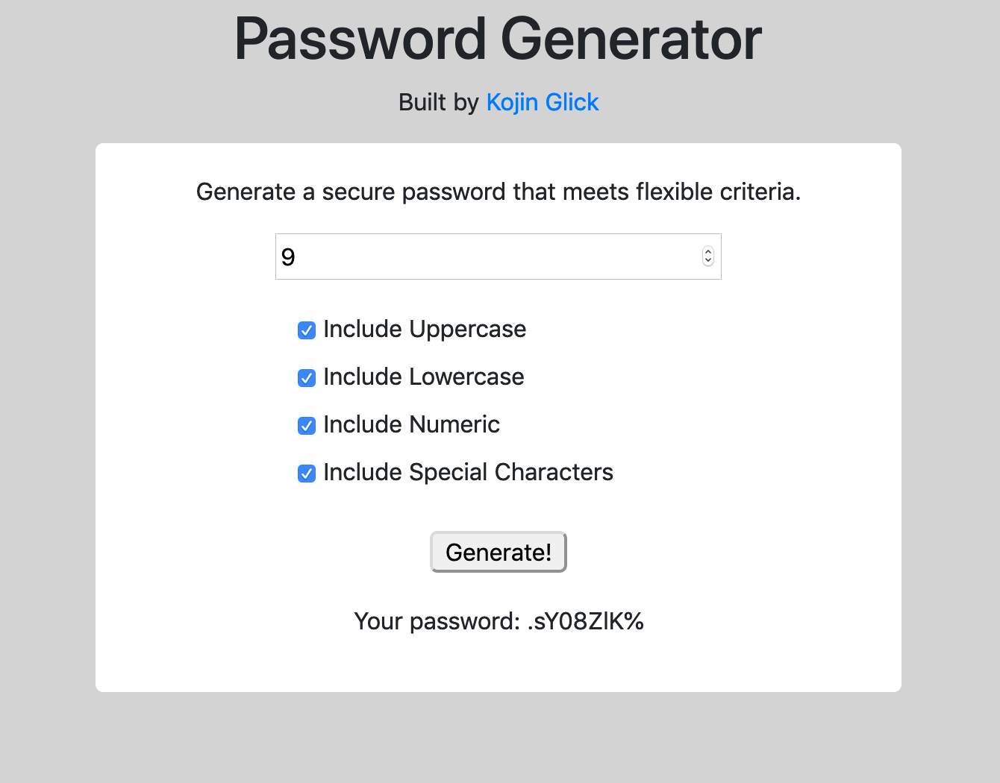

# Password Generator
> This site asks for a length input and character criteria to generate a pseudo-random password for use on user accounts.

## Release History

* 0.0.1
    * WIP, added logic for building a password
* 0.1.1
    * added HTML and CSS to make the site prettier!

## Meta
Repository [here](https://github.com/moonstripe11/hw3-passwordGenerator/).

Live Demo [here](https://moonstripe11.github.io/hw3-passwordGenerator/).

Kojin Glick – [@kojinglick](https://twitter.com/kojinglick) – kojinglick@gmail.com
